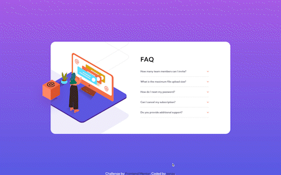
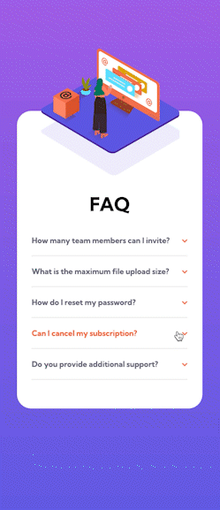

# Frontend Mentor - FAQ Accordion Card Solution

This is a solution to the [FAQ Accordion Card Challenge on Frontend Mentor](https://www.frontendmentor.io/challenges/faq-accordion-card-XlyjD0Oam). Frontend Mentor challenges help you improve your coding skills by building realistic projects.

## Table of contents

- [Overview](#overview)
  - [The challenge](#the-challenge)
  - [Screenshot](#screenshot)
  - [Links](#links)
- [My process](#my-process)
  - [Built with](#built-with)
  - [What I learned](#what-i-learned)
- [Author](#author)

## Overview

### The challenge

Users should be able to:

- View the optimal layout for the component depending on their device's screen size
- See hover states for all interactive elements on the page
- Hide/Show the answer to a question when the question is clicked

### Screenshot

#### Screensize 1440px - Desktop



#### Screensize 375px - Mobile



### Links

- View my Solution on [Frontend Mentor](https://www.frontendmentor.io/solutions/faq-accordion-with-vanilla-html-and-css-vGu9OECMtD)
- View the Live Site [here](https://kxnzx.github.io/faq-accordion-card/)

## My process

- HTML semantics
- Importing Google Fonts
- Set variables
- Reset default settings
- Styles (Mobile First)
- Media Queries

### Built with

- Semantic HTML5 markup
- SASS custom properties
- CSS Grid
- CSS Flexbox
- Mobile-first workflow
- [Google Fonts](https://fonts.google.com/) - For Fonts

### What I learned

This project was surprisingly fun, but also tricky!

I have spent quite some time on Googling which tag to use for the FAQ Accordion. After a considerable amount of time searching on the web, I found about the details and summary tags. These tags combined hide or open the answer of a question when the element is clicked on. JavaScript became unnecessary using these tags:

```html
<details>
  <summary><b>How many team members can I invite?</b></summary>
  <p>
    You can invite up to 2 additional users on the Free plan. There is no limit
    on team members for the Premium plan.
  </p>
</details>
```

The tricky part of this challenge was the layering of the elements, especially the box for the desktop design. I have spend quite some time figuring out how to position the box on the specified spot. Position absolute on the box with position relative on the body did not seem to work, because the element moved inwards while resizing the window. I also placed the box inside the FAQ Card (parent of the other background-images which is set on hidden overflow). I was looking for a way to force the child element (the box) to appear visible outside of the hidden overflow container with a disable function. This however was impossible. The solution I found was to place back the box outside the main and wrap the box and the main in a container which is set to position relative.

```css
 .container {
    width: 19.688rem;
    @media screen and (min-width: $desktop) {
      position: relative;
      width: 57.5rem;
    }
```

## Author

- Frontend Mentor - [@kxnzx](https://www.frontendmentor.io/profile/kxnzx)
